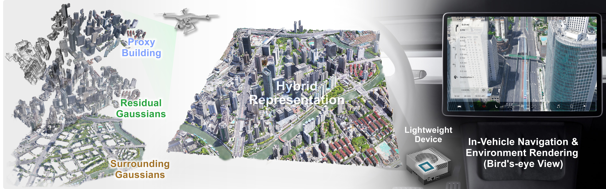
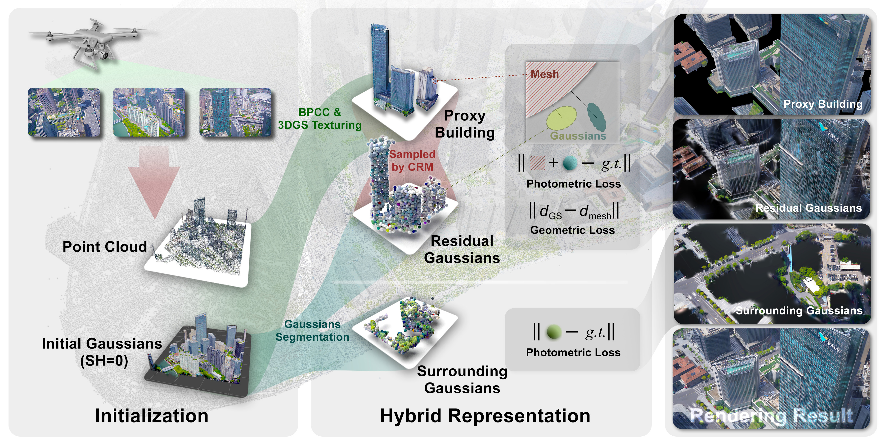

# CityGo: Lightweight Urban Modeling and Rendering with Proxy Buildings and Residual Gaussians

### [Project Page](https://citygo-weihang.github.io/page/) | [ArXiv](https://arxiv.org/abs/2505.21041) | [Paper](https://dl.acm.org/doi/10.1145/3757377.3763866)

[Weihang Liu*](https://weihangliu2024.github.io/), Yuhui Zhong*, [Yuke Li*](https://liyuke.cn/), Xi Chen, Jiadi Cui, Honglong Zhang, [Lan Xu](http://xu-lan.com/), [Xin Lou](https://sist.shanghaitech.edu.cn/louxin/main.htm), [Yujiao Shi](https://yujiaoshi.github.io/), [Jingyi Yu](https://www.yu-jingyi.com/), [Yingliang Zhang](https://www.linkedin.cn/incareer/in/yingliangzhang)


## Overview

<p align="center">

</p>

<p align="center">

</p>

CityGo introduces a hybrid framework combining textured proxy geometry with residual and surrounding 3D Gaussians to achieve lightweight, photorealistic reconstruction of large-scale urban aerial scenes, enabling real-time rendering on mobile devices with significantly reduced training time and memory usage while maintaining visual fidelity.


## Installation

1. Clone this repo:

```
git clone https://github.com/LiYukeee/CityGo --recursive
cd CityGo
```

2. Install dependencies

```
conda env create --file environment.yml
conda activate citygo
# install nvdiffrast and pytorch3d
pip install git+https://github.com/NVlabs/nvdiffrast.git --no-build-isolation
pip install "git+https://github.com/facebookresearch/pytorch3d.git@stable"
```

## data

For some reasons, the dataset is not publicly available. We apologize for the inconvenience.

## Run and Test

```
bash run_all.sh
```

## Result

| Method    | Area_H    |            |          |          |       | Area_L    |            |          |          |       |
|-----------|-----------|------------|----------|----------|-------|-----------|------------|----------|----------|-------|
|           | PSNR↑     | Size (MB)↓ | #GS (M)↓ | Time (h)↓ | FPS↑ | PSNR↑     | Size (MB)↓ | #GS (M)↓ | Time (h)↓ | FPS↑ |
| 3DGS      | 22.44     | 6319       | 40.39    | 24.3     | 33.60 | 25.00     | 6986       | 44.66    | 23.4     | 30.93 |
| 2DGS      | 22.19     | 4127       | 27.04    | 29.6     | 4.59  | 24.41     | 3849       | 25.22    | 31.2     | 5.09  |
| CityGS-v2 | 21.04     | 1140       | 7.33     | 30.5     | 5.27  | 23.95     | 1335       | 8.58     | 22.8     | 6.19  |
| Ours      | 21.93     | 741        | 4.74     | 20.6     | 161.14 | 23.97     | 624        | 3.60     | 21.2     | 196.00 |


## Citation

If you find our work helpful, please consider citing:

```bibtex
@misc{liu2025citygolightweighturbanmodeling,
      title={CityGo: Lightweight Urban Modeling and Rendering with Proxy Buildings and Residual Gaussians}, 
      author={Weihang Liu and Yuhui Zhong and Yuke Li and Xi Chen and Jiadi Cui and Honglong Zhang and Lan Xu and Xin Lou and Yujiao Shi and Jingyi Yu and Yingliang Zhang},
      year={2025},
      eprint={2505.21041},
      archivePrefix={arXiv},
      primaryClass={cs.GR},
      url={https://arxiv.org/abs/2505.21041}, 
}
```

## LICENSE

Please follow the LICENSE of [3D-GS](https://github.com/graphdeco-inria/gaussian-splatting).